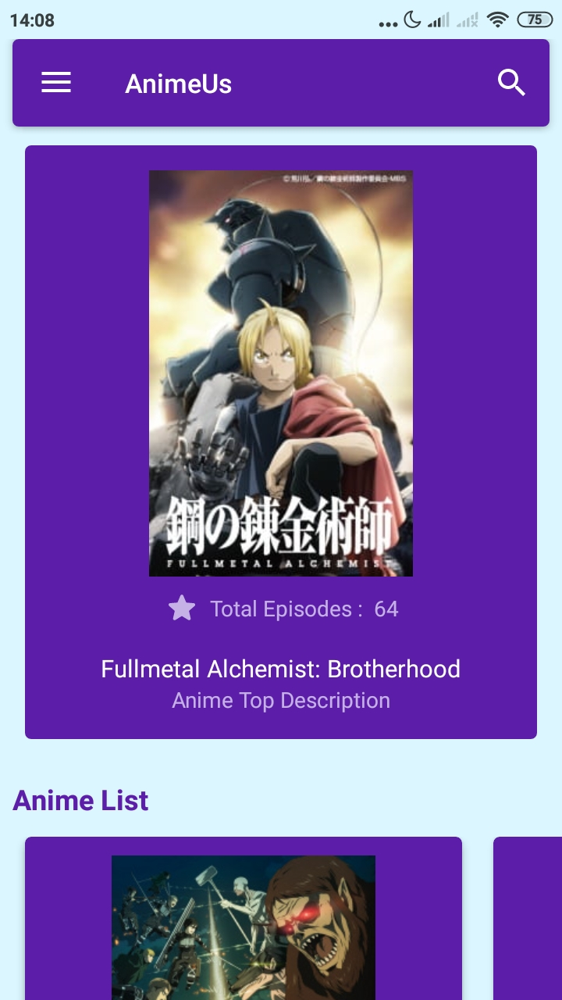
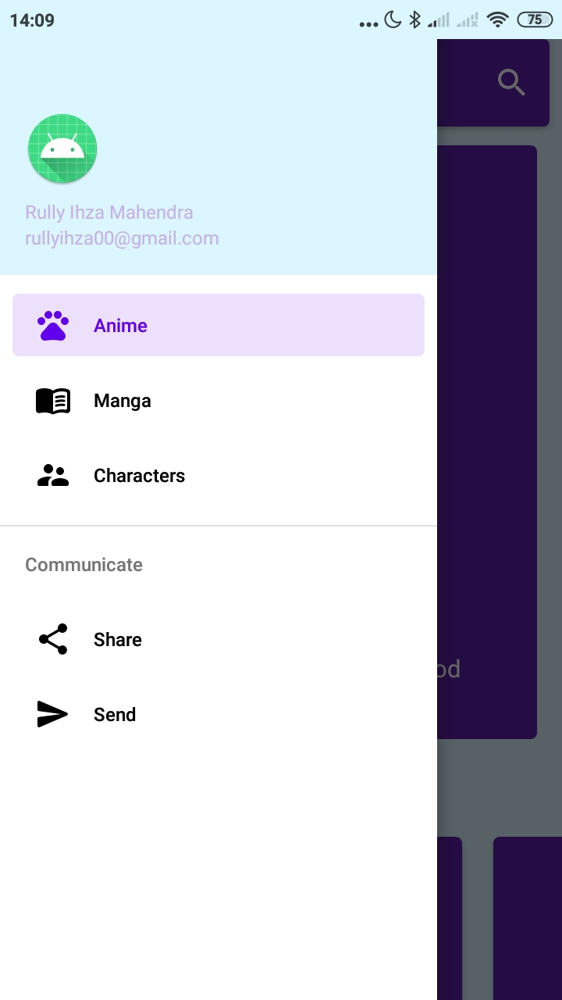

## **AnimeUs Android App**

The features that have not been implemented yet:
 1.Search option
    - url => `https://api.jikan.moe/v3/search/type?q=Fate/Zero&page=1`
    - type => {anime, manga, character, person}

# **AnimeUs Android App**

Application that provides some information of Anime, Manga, Characters. This app is an Android version of my WebApp Project, called `AnimeUS Responsive Web`.

### Features

- Show Anime list
- Show Manga list
- Show Characters list
- Show Top Anime and Manga list
- Detail description of each Anime and Manga

This application uses an unofficial MyAnimeList API in order to provide some information.
[This api](https://api.jikan.moe/v3) was created by [`Jikan`](https://github.com/jikan-me/jikan).
Here's the link if you want to use it as well :

> Official Doc :  [`https://jikan.moe/`](https://jikan.moe/)

> Base url of API :  [`https://api.jikan.moe/v3`](https://api.jikan.moe/v3)

 

### Preview

